### Table Content

1. [[1. Logic Function Optimization#Multiplexer|Multiplexer]]
2. [[1. Logic Function Optimization#Shannon's Expansion|Shannon's Expansion]]
3. [[1. Logic Function Optimization#Encoder|Encoder]]
4. [[1. Logic Function Optimization#Decoder|Decoder]]

# Multiplexer

**2-to-1 multiplexer**

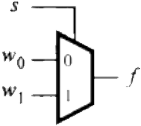

| $s$   | $f$  |
| --- | --- |
| $0$   | $w_{0}$    |
| $1$    |  $w_{1}$   |

**4-to-1 multiplexer**

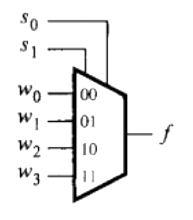

| $s_{1}$ | $s_{0}$ | $f$     |
| ------- | ------- | ------- |
| $0$       | $0$       | $w_{0}$ |
| $0$       | $1$       | $w_{1}$ |
| $1$       | $0$       | $w_{2}$ |
| $1$       | $1$       | $w_{3}$        |

###### Example
Implement function $f$ using a multiplexer

| $w_{1}$ | $w_{2}$ | $w_{3}$ | $f$ |
| ------- | ------- | ------- | --- |
| $0$     | $0$     | $0$     | $0$ |
| $0$     | $0$     | $1$     | $0$ |
| $0$     | $1$     | $0$     | $0$ |
| $0$     | $1$     | $1$     | $1$ |
| $1$     | $0$     | $0$     | $0$ |
| $1$     | $0$     | $1$     | $1$ |
| $1$     | $1$     | $0$     | $1$ |
| $1$     | $1$     | $1$     | $1$ |

**Solution:**
Use $w_{1}$ and $w_{2}$ as selector

1.  *First two rows from above table:*

| $w_{1}$ | $w_{2}$ | $w_{3}$ | $f$ |
| ------- | ------- | ------- | --- |
| $0$     | $0$     | $0$     | $0$ |
| $0$     | $0$     | $1$     | $0$ |

*simplified to*

| $w_{1}$ | $w_{2}$ | $f$ |
| ------- | ------- | --- |
| $0$       | $0$       | $1$    |

- *then*

| $w_{1}$ | $w_{2}$ | $w_{3}$ | $f$ |
| ------- | ------- | ------- | --- |
| $0$     | $1$     | $0$     | $0$ |
| $0$     | $1$     | $1$     | $1$ |

*simplified to*

| $w_{1}$ | $w_{2}$ | $f$ |
| ------- | ------- | ------- | 
| $0$     | $1$     | $w_{3}$     | 

- *then*

| $w_{1}$ | $w_{2}$ | $w_{3}$ | $f$ |
| ------- | ------- | ------- | --- |
| $1$     | $0$     | $0$     | $0$ |
| $1$     | $0$     | $1$     | $1$ |

*simplified to*

| $w_{1}$ | $w_{2}$ | $f$ |
| ------- | ------- | ------- | 
| $1$     | $0$     | $w_{3}$     | 

- *then*

| $w_{1}$ | $w_{2}$ | $w_{3}$ | $f$ |
| ------- | ------- | ------- | --- |
| $1$     | $1$     | $0$     | $1$ |
| $1$     | $1$     | $1$     | $1$ |

*simplified to*

| $w_{1}$ | $w_{2}$ | $f$ |
| ------- | ------- | ------- | 
| $1$     | $1$     | $1$     | 

2. Combine the table

| $w_{1}$ | $w_{2}$ | $f$ |
| ------- | ------- | --- |
| $0$       | $0$       | $1$    |
| $0$     | $1$     | $w_{3}$     | 
| $1$     | $0$     | $w_{3}$     | 
| $1$     | $1$     | $1$     | 

3. Draw the logic gate

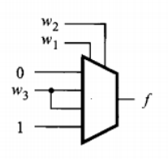

##### Example

Draw the logic gate with 4 to 1multiplexer
$f=\overline{w_{1}}\ \overline{w_{2}}w_{3}+\overline{w_{1}}w_{2}\overline{w_{3}}+w_{1}\overline{w_{2}}w_{3}+w_{1}w_{2}$

*Solution*

$f=\overline{w_{1}}\ \overline{w_{2}}(w_{3})+\overline{w_{1}}w_{2}(\overline{w_{3}})+w_{1}\overline{w_{2}}(w_{3})+w_{1}w_{2}(1)$

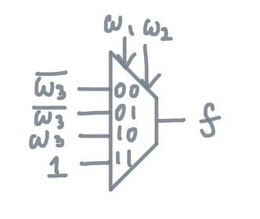

***

# Shannon's Expansion

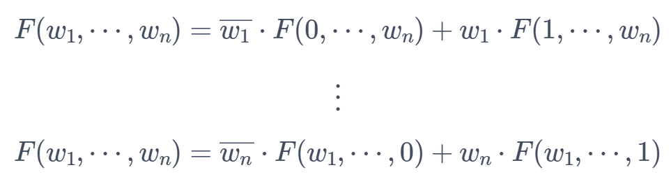

### Steps:
1. Rewrite the boolean function with the first shannon's expansion ($w_{1}$) and evaluate
2. Use previous function and rewrite it with the $w_{2}$ shannon's expansion
3. loop step 2 with $w_{3} \cdots w_{n}$

###### Example

$F(w_{1},w_{2},w_{3})=\overline{w_{1}}w_{3}+w_{2}\overline{w_{3}}$

**Solution**

- *For $w_{1}$*

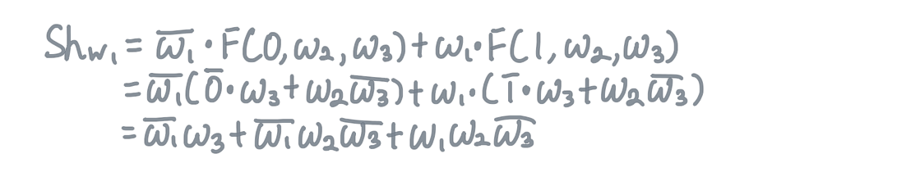

*Simplify*

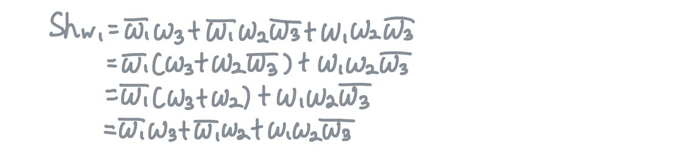

- *For $w_{2}$*

*Simplify*

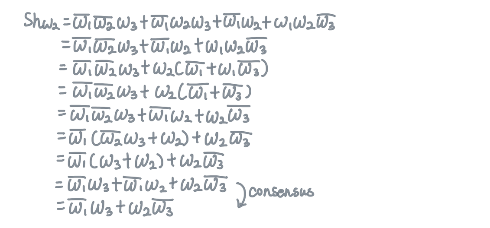

- *For $w_{3}$*

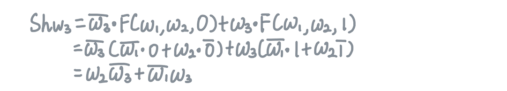

- Since $Sh_{w_{3}}$ is the less expensive

$Sh_{w_{3}}=\overline{w_{3}}(w_{2})+w_{3}(w_{1})$

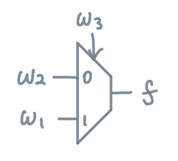

***
# Decoder

**$n$ to $2^n$ Decoders**

**2 to 4 Decoder with Enable**

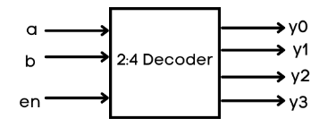

| En  | $a$ | $b$ | $y_{0}$ | $y_{1}$ | $y_{2}$ | $y_{3}$ |
| --- | --- | --- | ------- | ------- | ------- | ------- |
| 0   | x   | x   | 0       | 0       | 0       | 0       |
| 1   | 0   | 0   | 1       | 0       | 0       | 0       |
| 1   | 0   | 1   | 0       | 1       | 0       | 0       |
| 1   | 1   | 0   | 0       | 0       | 1       | 0       |
| 1   | 1   | 1   | 0       | 0       | 0       | 1        |

***
# Encoder
**$2^n$ to $n$ Encoder**

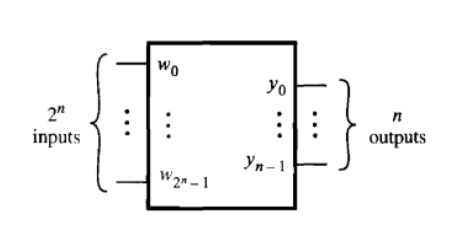

**4 to 2 Encoder**

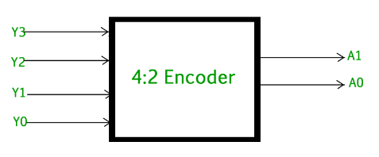

| $Y_{0}$ | $Y_{1}$ | $Y_{2}$ | $Y_{3}$ | $A_{1}$ | $A_{0}$ |
| ------- | ------- | ------- | ------- | ------- | ------- |
| 1       | 0       | 0       | 0       | 0       | 0       |
| 0       | 1       | 0       | 0       | 0       | 1       |
| 0       | 0       | 1       | 0       | 1       | 0       |
| 0       | 0       | 0       | 1       | 1       | 1        |

***
# Demultiplexer
**1 to 4 demultiplexer**

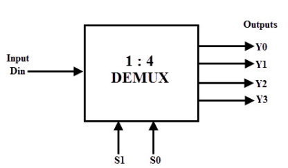

| $s_{1}$ | $s_{0}$ | $Y_{0}$ | $Y_{1}$ | $Y_{2}$ | $Y_{3}$ |
| ------- | ------- | ------- | ------- | ------- | ------- |
| 0       | 0       | d       | 0       | 0       | 0       |
| 0       | 1       | 0       | d       | 0       | 0       |
| 1       | 0       | 0       | 0       | d       | 0       |
| 1       | 1       | 0       | 0       | 0       | d        |

figure 3:

$$F(w_{1},\cdots, w_{n})=\overline{w_{1}}\cdot F(0,\cdots, w_{n})+w_{1}\cdot F(1,\cdots, w_{n})$$ 

$$\vdots$$

$$F(w_{1},\cdots, w_{n})=\overline{w_{n}}\cdot F(w_{1},\cdots, 0)+w_{n}\cdot F(w_{1},\cdots, 1)$$

