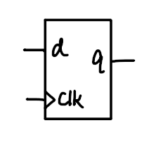
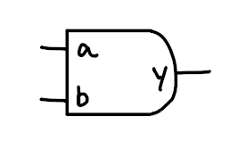
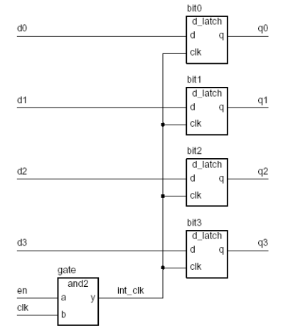

- Very High Speed Integrated Circuit Hardware Description Language
- Describe the behaviour and structure of digital electronic systems(e.g. circuit)
- Used to design, simulate and test system models before they are actually built

1. Modelling:
	- [[2. VHDL Introduction#Interfaces|Interfaces]]
	- [[2. VHDL Introduction#Architecture(Defines Behaviour)|Behaviour]]
	- [[2. VHDL Introduction#Structural Architecture|Structure]]
	- [[2. VHDL Introduction#Structure and Behaviour|Structural and Behavioural Architecture]]
2. [[2. VHDL Introduction#Testbench|Testbench]]
3. Design Procedure
	- [[2. VHDL Introduction#Analysis|Analysis]]
	- [[2. VHDL Introduction#Elaboration|Elaboration]]
	- [[2. VHDL Introduction#Simulation|Simulation]]
	- [[2. VHDL Introduction#Synthesis|Synthesis]]

***

# Interfaces
- define the inputs and outputs of a module(ports)

``` vhdl
entity <entityName> is
	port(
		<portName0>, <portName1> : in <portType>;
		<portName2>, <portName3> : out <portType>;
	);
end entity <entityName>;
```

**Entity Name:**  the specific name of the circuit being designed (e.g. `reg4` is 4-bit register)

**Port:** Define the inputs and outputs of the circuit

**Port Type:** Defines what kind of data the port handles (e.g. `bit`, `std_logic`, `integer`)

**in:** input

**out:** output

##### Example
Entity of D-latch



```vhdl
entity d_latch is
	port (
		d, clk : in bit;
		q : out bit;
	)
end entity d_latch;
```

##### Example
Entity of AND gate(and2)



``` vhdl
entity and2 is
	port(
		a, b : in bit;
		y : out bit;
	)
end and2;
```

***
# Architecture(Defines Behaviour)

- Architecture define how the entity behaves internally(logic of the system implemented)
- Behaviour defines how the system responds to its inputs and what the outputs should be
- Each entity can have one or more architectures(typically only one)

### Behavioural Architecture
Contains;
- Process Expressions
	- a "function" that runs every time an input value changes
- Sequential Expressions
	- instructions that run in sequence inside a process
- Signal Assignment Expressions
	- used to update or assign values to signals(e.g. input or output)
- Wait Expressions
	- tell the process to pause until a situation changed

``` vhdl
architecture <architectureName> of <entityName> is
begin
	-- Process Expression
	<processName> : process is
		variable <storedSignal0>, <storedSignal1> : <signalType>; -- (Optional)
	begin
		-- Sequential Expression
		-- Signal Assignment Expression
		-- Wait Expressions
	end process <processName>;
end architecture <architectureName>;
```

**Stored Signal:** Temporary variables used to store values inside the process

#### Signal assignment operator

| Operator          | Definition                                        | Example                          |
| ----------------- | ------------------------------------------------- | -------------------------------- |
| `:=`              | assign values to variables (immediately)          | `x := x + 1;`                    |
| `<=`              | assign values to signals (delays to be specified) | `x <= '1'`                       |
| `when` ... `else` | assign values to signal based on conditions       | `y <= '1' when (a='1') else '0'` |

**Aggregate Assignment**
- Assign multiple values to an array or record in a single statement
``` vhdl
signal <variable> : std_logic_vector(<number> downto 0);
<variable> <= "<values>" 
```


**E.g.**

```vhdl
signal a : std_logic_vector(3 downto 0);
a <= "1010";
```

- a(3) = 1
- a(2) = 0
- a(1) = 1
- a(0) = 0

##### Example

Architecture of D-latch

| D   | Q   |
| --- | --- |
| 0   | 0   |
| 1   | 1    |

```vhdl
architecture basic of d_latch is
begin
	latch_behavior : process is
	begin
		if clk = '1' then
			q <= d after 2 ns;
		end if;
		wait on clk, d;
	end process latch_behavior;
end architecture basic;
```

##### Example

Architecture of AND gate

``` vhdl
architecture basic of and2 is
begin
	and2_behavior : process is
	begin 
		y <= a and b after 2 ns;
		wait on and2;
	end process and2_behavior;
end architecture basic;
```

***

# Structural Architecture
- Used to build a larger circuit by assembling multiple entity
- Contains;
	- Signal Expression
		- Treat entity ports as signals
	- Component instances
		- declared entity/architecture instance
	- Port Maps
		- connect signals to the component's inputs and outputs

``` vhdl
architecture <architectureName> of <entityName> is
	signal <signalName> : <signalType>;
begin
	--- Instantiate Components
	<componentInstance0> : entity <libraryName>.<componentName>(<architectureOfComponent>)
	port map(<inputSignals>, <outputSignals>);
end architecture <architectureName>;
```

*Library:* contains all compiled entities and architecture(like packages). `work` is the default library

##### Example 
Structural Architecture of a register(reg4)



``` vhdl
architecture structure of reg4 is
	signal int_clk : bit;
begin
	gate: entity work.and2(basic)
		port map(en, clk, int_clk);
	bit0 : entity work.d_latch(basic)
		port map (d0, int_clk, q0);
	bit1 : entity work.d_latch(basic)
		port map (d1, int_clk, q1);
	bit2 : entity work.d_latch(basic)
		port map (d2, int_clk, q2);
	bit3 : entity work.d_latch(basic)
		port map (d3, int_clk, q3);
end architecture structure;
```

***
# Structure and Behaviour
- can be in the same architecture
- e.g. when designing in **RTL(Register Transfer Level) model**;
	- **Datapath**: describes the movement of data and operations in a structural way
	- **Control Path**: describes the logic controlling the datapath's behaviour

##### Example

VHDL of a register(reg4)


``` vhdl
-- entity declaration
entity reg4 is 
	port (
		d0, d1, d2, d3 : in bit;
		en, clk : in bit;
		q0, q1, q2, q3 : out bit;
	)
end entity reg4;

-- architecture that combines structure and behaviour
architecture mixed of reg4 is
	signal int_clk : bit;

begin
	-- Structural: instantiate (Dlatch and AND2)
	gate : entity work.and2(behavior)
		port map(a => en, b => clk, y => int_clk);
	bit0 : entity work.d_latch(behavior)
		port map(d => d0, clk => int_clk, q => q0);
	bit1 : entity work.d_latch(behavior)
		port map(d => d1, clk => int_clk, q => q1);
	bit2 : entity work.d_latch(behavior)
		port map(d => d2, clk => int_clk, q => q2);
	bit3 : entity work.d_latch(behavior)
		port map(d => d3, clk => int_clk, q => q3);
	
	-- Behavioural: control the internal clock signal
	process (en, clk)
	begin
		if (en '1' and clk = '1') then
			int_clk <= '1';
		else
			int_clk <= '0' after 2 ns;
		end if
		wait on en, clk;
	end process;
end architecture mixed;
```

***

# VHDL-87
- an older version of VHDL
- cannot directly instantiate an entity/architecture pair in a architecture
- *Steps to Instantiate a Component;*
	1. Component Declaration
	2. Component Instantiation
	3. Configuration Declaration

##### Example
Component Instantiation of a register(reg4) in VHDL-87


1. Component Declaration
``` vhdl
architecture structure of reg4 is
	component d_latch
		port (
			d, clk : in bit;
			q : out bit
		);
	end component

	component and2
		port (
			a, b : in bit;
			y : out bit
		);
	end component
	
	signal int_clk : bit;
```

2. Component Instantiation

``` vhdl
architecture structure of reg4 is
begin
	gate : and2
		port map(en, clk, int_clk);
	bit0 : d_latch
		port map (d0, int_clk, q0);
	bit1 : d_latch
		port map (d1, int_clk, q1);
	bit2 : d_latch
		port map (d2, int_clk, q2);
	bit3 : d_latch
		port map (d3, int_clk, q3);
end architecture structure;
```

3. Configuration Declaration

``` vhdl
configuration basic_level of reg4 is
	for structure
		for all : d_latch
			use entity work.d_latch(basic);
		end for;
		for all : and2
			use entity work.and2(basic);
		end for;
	end for;
end basic_level;
```

***

# Testbench
- an architecture used to test and verify a design by simulating its behaviour

##### Example

Testbench of reg4

``` vhdl
-- entity declaration
entity test_bench is
end entity test_bench;

-- architecture declaration
architecture test_reg4 of test_bench is
    signal d0, d1, d2, d3, en, clk, q0, q1, q2, q3 : bit;
begin
    dut : entity work.reg4(behav)
        port map ( d0, d1, d2, d3, en, clk, q0, q1, q2, q3 );
    -- stimulus process
        stimulus : process is
    begin
	    -- test cases 1
        d0 <= '1'; d1 <= '1'; d2 <= '1'; d3 <= '1'; wait for 20 ns;
        en <= '0'; clk <= '0'; wait for 20 ns;
        en <= '1'; wait for 20 ns;
        clk <= '1'; wait for 20 ns;
        d0 <= '0'; d1 <= '0'; d2 <= '0'; d3 <= '0'; wait for 20 ns;
        en <= '0'; wait for 20 ns;
        -- Continue with more test cases
        wait;
    end process stimulus;
end architecture test_reg4;

```

***
# Design Procedure

### Analysis
- check for syntax and semantic errors in the design
- **Semantics Check**: ensure the model has meaningful behaviour
- analyzed design units are placed in library(`work` )

### Elaboration
1. Create and connect every input and output(ports)
2. Component Instantiation
3. Turns all the nested components into a single level with all components connected by signals

### Simulation
- simulate the model to verify behaviour
- transactions are scheduled and executed to check how the system behaves with specific inputs over time(events)
- simulation algorithm;
	1. Initialization Phase
		- Simulation time is set to 0
		- Each signal is initialized with a value
		- Each process is activated and runs until it encounters a wait statement
	2. Simulation Cycle
		- simulation time advances until the next transaction
		- for each transaction, signal values are updated, and events are triggered if the value has changed
	3. simulation continues until no further transactions are scheduled

### Synthesis
- translate the RTL design into a gate-level netlist
- **netlist**: describes the design in terms of gates and connections for hardware
- cons: not able to use while loop
