### Table Content
1. [[3. VHDL for Synthesis#SR Latch Synthesis|SR Latch Synthesis]]
	- [[3. VHDL for Synthesis#SR Latch (nor gate)|SR Lath (nor gate)]]
	- [[3. VHDL for Synthesis#SR Latch(nand gate)|SR Latch (nand gate)]]
	- [[3. VHDL for Synthesis#SR Latch with enable|SR Latch with enable]]
2. [[3. VHDL for Synthesis#D Latch Synthesis|D Latch Synthesis]]
3. [[3. VHDL for Synthesis#D Flip Flop Synthesis|D Flip Flop Synthesis]]
	- [[3. VHDL for Synthesis#Enabled D Flip Flop|Enabled D Flip Flop]]
	- [[3. VHDL for Synthesis#Enabled Asynchronous Reset D Flip Flop|Enabled Asynchronous Reset D Flip Flop]]
4. [[3. VHDL for Synthesis#JK Flip Flop Synthesis|JK Flip Flop Synthesis]]
5. [[3. VHDL for Synthesis#T Flip Flop Synthesis|T Flip Flop Synthesis]]
6. [[3. VHDL for Synthesis#Register Synthesis|Register Synthesis]]
7. [[3. VHDL for Synthesis#Shift Register|Shift Register]]
8. [[3. VHDL for Synthesis#Counter Synthesis|Counter Synthesis]]
9. [[3. VHDL for Synthesis#Comparator Synthesis|Comparator Synthesis]]
10. [[3. VHDL for Synthesis#Adder Synthesis|Adder Synthesis]]

***
# SR Latch Synthesis

**SR Latch Truth Table**

| $S$ | $R$ | $Q_{t+1}$ | $\overline{Q_{t+1}}$ |
| --- | --- | --------- | -------------------- |
| 0   | 0   | $Q_{t}$   | $\overline{Q_{t}}$   |
| 0   | 1   | 0         | 1                    |
| 1   | 0   | 1         | 0                    |
| 1   | 1   | 0         | 0                     |

## SR Latch (nor gate)

**Circuit:**

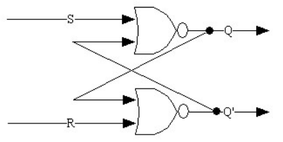

``` vhdl
LIBRARY ieeel
USE ieee.std_logic_1164.All;

-- Entity Declaration
Entity srLatch is
	port (
		i_set, i_reset : in std_logic;
		o_q, o_qBar : out std_logic
	);
end srLatch;

-- Architecture Declaration
Architecture rtl of srLatch is
	signal int_q, int_qBar : std_logic;
Begin 
	-- Concurrent Signal Assignment
	int_q <= i_set nor int_qBar;
	int_qBar <= i_reset nor int_q;
	
	-- Output Driver
	o_q <= int_q;
	p_qBar <= int_qBar;
end architecture rtl;
```

**std_logic**: represent a single logic signal with multiple possible values
- `U`: Uninitialized
- `X`: Forcing unknown
- `0`: Logic 0
- `1`: Logic 1
- `Z`: High impedance
- `W`: Weak unknown
- `L`: Weak 0
- `H`: Weak 1
- `-`: Don't care

## SR Latch(nand gate)

**Circuit:**

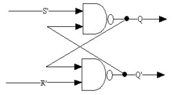

``` vhdl
LIBRARY ieeel
USE ieee.std_logic_1164.All;

Entity srLatch is
	port (
		i_setBar, i_resetBar : in std_logic;
		o_q, o_qBar : out std_logic
	);
end srLatch;

Architecture rtl of srLatch is
	signal int_q, int_qBar : std_logic;
Begin 
	int_q <= i_setBar nand int_qBar;
	int_qBar <= i_resetBar nand int_q;
	
	o_q <= int_q;
	p_qBar <= int_qBar;
end architecture rtl;
```

## SR Latch with enable

**Circuit:**

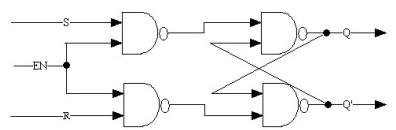

``` vhdl
Library ieee;
Use ieee.std_logic_1164.all;

entity enableSRLatch is
	port (
		i_set, i_reset, i_enable : in std_logic;
		o_q, o_qBar : out std_logic
	);
end enableSRLatch;

architecture rtl of enableSRLatch is
	signal int_q, int_qBar : std_logic;
	signal int_sSignal, int_rSignal;

Begin
	int_sSignal <= i_set nand i_enable;
	int_rSignal <= i_reset nand i_enable;
	int_q <= int_sSignal nand int_qBar;
	int_qBar <= int_rSignal nand int_q;
	
	o_q <= int_q;
	o_qBar <= int_qBar;
end rtl
```

***

# D Latch Synthesis

**Truth Table:**

| En  | D   | $Q_{t+1}$ | $\overline{Q_{t+1}}$ |
| --- | --- | --------- | -------------------- |
| 0   | x   | $Q_{t}$   | $\overline{Q_{t}}$   |
| 1   | 0   | 0         | 1                    |
| 1   | 1   | 1         | 0                     |

**Circuit:**

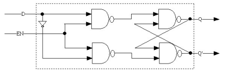

```vhdl
Library ieee;
Use ieee.std_logic_1164.all;

entity dlatch is
	port (
		i_d, i_enable : in std_logic;
		o_q, o_qBar : out std_logic
	);
end dlatch

architecture rtl of dLatch is
	signal int_q, int_qBar : std_logic;
	signal int_d, int_dBar : std_logic;
	signal int_notd;

begin
	int_notd <= not(i_d);
	int_d <= i_d nand i_enable;
	int_dBar <= int_notd nand int_enable;
	int_q <= int_d nand int_qBar;
	int_qBar <= int_dBar nand int_q;
	
	o_q <= int_q;
	o_qBar <= int_qBar;
end rtl
```

# D Flip Flop Synthesis

| clk        | D   | $Q_{t+1}$ | $\overline{Q_{t+1}}$ |
| ---------- | --- | --------- | -------------------- |
| 0          | x   | $Q_{t}$   | $\overline{Q_{t}}$   |
| 1          | x   | $Q_{t}$   | $\overline{Q_{t}}$   |
| $\uparrow$ | 0   | 0         | 1                    |
| $\uparrow$ | 1   | 1         | 0                     |

**Circuit:**

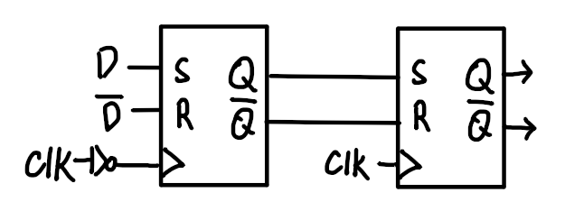

**Waveform(not complete):**

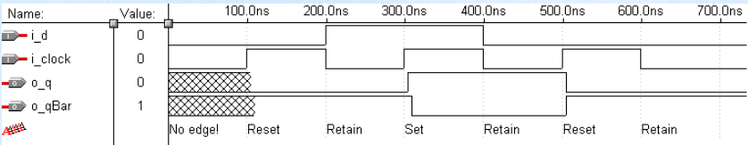

``` vhdl
Library ieee;
Use ieee.std_logic_1164.all;

entity dFF is
	port(
		i_d, i_clock : in std_logic;
		o_q, o_qBar : out std_logic;
	)
end dff;

Architecture rtl of dFF is
	signal int_q, int_qBar : std_logic;
	signal int_d, int_dBar : std_logic;
	signal int_notD, int_notClock : std_logic;
	
	component enableSRLatch
	port(
		i_set, i_reset, i_enable : in std_logic;
		o_q, o_qBar : out std_logic;
	)
	end component

Begin 
	masterLatch : enabledSRLatch
	port map (
		i_set => i_d,
		i_reset => int_notD,
		i_enable => int_notClock,
		o_q =>int_q,
		o_qBar => int_qBar
	);
	
	slaveLatch : enabledSRLatch
	port map (
		i_set => int_d,
		i_reset => int_qBar,
		i_enable => int_Clock,
		o_q =>o_q,
		o_qBar => o_qBar
	);
	
	int_notD <= not(i_d);
	int_notClock <= not(i_clock);
```

**Waveform(complete):**

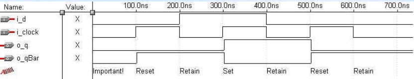

``` vhdl
Library ieee;
Use ieee.std_logic_1164.all;

entity dFF_2 is
	port(
		i_d, i_clock : in std_logic;
		o_q, o_qBar : out std_logic;
	)
end dff_2;

Architecture rtl of dff_2 is:
	signal int_q : std_logic;

Begin
oneBitRegister : Process(i_clock)
Begin
	if (i_clockEvent and i_clock = '1') then -- trigger on rising edge of clock
		int_q <= i_d;
	end if;
end process oneBitRegister;
	
	o_q <= int_q;
	o_qBar <= not(int_q);
end rtl;
```

## Enabled D Flip Flop

``` vhdl
Library ieee;
Use ieee.std_logic_1164.all;

entity endFF_2 is
	port(
		i_d, i_clock, i_enable : in std_logic;
		o_q, o_qBar : out std_logic;
	)
end endff_2;

Architecture rtl of endff_2 is:
	signal int_q : std_logic;

Begin
oneBitRegister : Process(i_clock)
Begin
	if (i_clockEvent and i_clock = '1') then
		if (i_enable = '1') then
			int_q <= i_d;
		end if;
	end if;
end process oneBitRegister;
	
	o_q <= int_q;
	o_qBar <= not(int_q);
end rtl;
```


## Enabled Asynchronous Reset D Flip Flop
- reset the output to a 0 independently of the clock signal

``` vhdl
Library ieee;
Use ieee.std_logic_1164.all;

entity enARdFF_2 is
	port(
		i_resetBar, i_d, i_clock, i_enable : in std_logic;
		o_q, o_qBar : out std_logic;
	)
end enARdff_2;

Architecture rtl of enARdff_2 is:
	signal int_q : std_logic;

Begin
oneBitRegister : Process(i_clock)
Begin
	if (i_resetBar = '0') then
		int_q <= 0;
	elsif (i_clockEvent and i_clock = '1') then
		if (i_enable = '1') then
			int_q <= i_d;
		end if;
	end if;
end process oneBitRegister;
	
	o_q <= int_q;
	o_qBar <= not(int_q);
end rtl;
```

***

# JK Flip Flop Synthesis

**Truth Table:**

| clk        | J   | K   | $Q_{t+1}$ | $\overline{Q_{t+1}}$ |
| ---------- | --- | --- | --------- | -------------------- |
| 0          | x   | x   | $Q_{t}$   | $\overline{Q_{t}}$   |
| 1          | x   | x   | $Q_{t}$   | $\overline{Q_{t}}$   |
| $\uparrow$ | 0   | 0   | $Q_{t}$   | $\overline{Q_{t}}$   |
| $\uparrow$ | 0   | 1   | 0         | 1                    |
| $\uparrow$ | 1   | 0   | 1         | 0                    |
| $\uparrow$ | 1   | 1   |  $\overline{Q_{t}}$         |    $Q_{t}$                  |

``` vhdl
Library ieee;
Use ieee.std_logic_1164.all;

entity jkff is
	port (
		i_j, i_k, i_clock : in std_logic;
		o_q, o_qBar : out std_logic
	);
end jkff;

architecture rtl of jkff is
	signal int_q : std_logic;
Begin

oneBitRegister:
process(i_clock)
Begin
	if (i_clockEvent and i_clock = '1') then
		if (i_j = '0' and i_k = '1') then
			int_q <= '0';
		elsif (i_j = '1' and i_k = '0') then
			int_q <= '1';
		elsif (i_j = '1' and i_k = '1') then
			int_q <= int_q;
		end if;
	end if;
end process oneBitRegister;

	o_q <= int_q;
	o_qBar <= not(int_q);
end rtl;
```


**Circuit:**

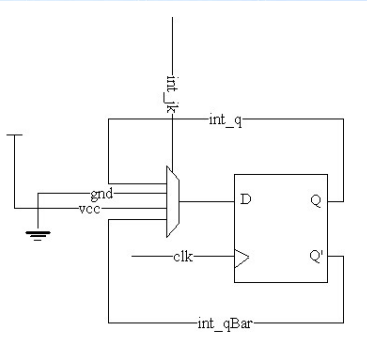

``` vhdl
Library ieee;
Use ieee.std_logic_1164.all;

entity jkFF_2 is
	port (
		i_j, i_k, i_clock : in std_logic;
		o_q, o_qBar : out std_logic
	);
end jkFF_2;

architecture rtl of jkFF_2 is
	signal int_q, int_qBar, int_muxOutput : std_logic;
	signal int_jk : std_logic_vector(1 downto 0);
	
	component dFF_2
		port(
			i_d, i_clock : in std_logic;
			o_q, o_qBar : out std_logic;
		)
	end component;

Begin
dFlipFlop : dFF_2
	port map (
		i_d => int_muxOutput,
		i_clock => i_clock,
		o_q => int_q,
		o_qBar => int_qBar
	);
int_jk <= i_j & i_k;
int_muxOutput <= 
				int_q when int_jk ='00' else
				'0' when int_jk = '01' else
				'1' when int_jk = '10' else
				int_qBar;

	o_q <= int_q;
	o_qBar <= int_qBar;
end rtl;
```

***

# T Flip Flop Synthesis

| clk        | T   | $Q_{t+1}$          | $\overline{Q_{t+1}}$ |
| ---------- | --- | ------------------ | -------------------- |
| 0          | x   | $Q_{t}$            | $\overline{Q_{t}}$   |
| 1          | x   | $Q_{t}$            | $\overline{Q_{t}}$   |
| $\uparrow$ | 0   | $Q_{t}$            | $\overline{Q_{t}}$   |
| $\uparrow$ | 1   | $\overline{Q_{t}}$ | $Q_{t}$              | 


**Circuit:**

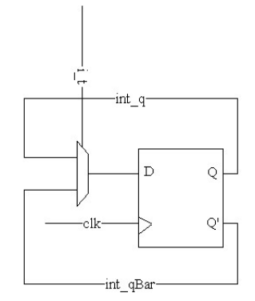


***

# Register Synthesis

- collection of flip lops that share a common clock input
- use of enable D flip flops simplifies the design of loadable registers

**n Bit Register**

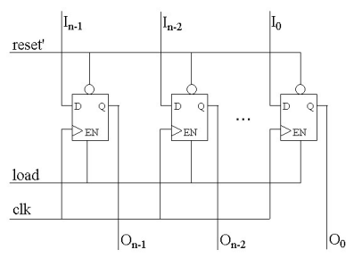

#### Example
Three Bit Register

``` vhdl
Library ieee;
Use ieee.std_logic_1164.all;

entity threeBitRegister is
	port (
		i_resetBar, i_load, i_clock : in std_logic;
		i_value : in std_logic_vector(2 downto 0);
		o_value : out std_logic_vector(2 downto 0)
	);
end threeBitRegister;

Architecture rtl of threeBitRegister is
	signal int_value, int_notValue : std_logic_vector(2 downto 0);

	component enARdFF_2
		port (
			i_resetBar, i_d, i_enable, i_clock : in std_logic;
			o_q, o_qBar : out std_logic;
		);
	end component

Begin

msb : enARdFF_2
	port map (
		i_resetBar => i_resetBar;
		i_d => i_Value(2);
		i_enable => i_load,
		i_clock => i_clock,
		o_q => int_Value(2);
		o_qBar =>int_notValue(2);
	);

ssb : enARdFF_2
	port map (
		i_resetBar => i_resetBar;
		i_d => i_Value(1);
		i_enable => i_load,
		i_clock => i_clock,
		o_q => int_Value(1);
		o_qBar =>int_notValue(1);
	);

lsb : enARdFF_2
	port map (
		i_resetBar => i_resetBar;
		i_d => i_Value(0);
		i_enable => i_load,
		i_clock => i_clock,
		o_q => int_Value(0);
		o_qBar =>int_notValue(0);
	);

	o_Value <= int_Value;
end rtl;
```


***

# Shift Register

**n Bit Shift Register**

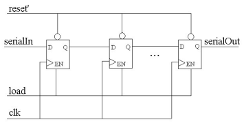

***

# Counter Synthesis
- a counter

##### Example
Two bit binary up counter

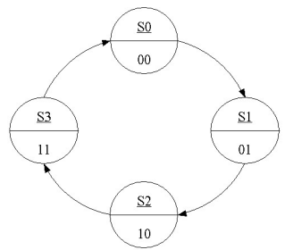

**Truth Table:**

| A   | B   | NA  | NB  |
| --- | --- | --- | --- |
| 0   | 0   | 0   | 1   |
| 0   | 1   | 1   | 0   |
| 1   | 0   | 1   | 1   |
| 1   | 1   | 0   | 0    |

**Circuit:**

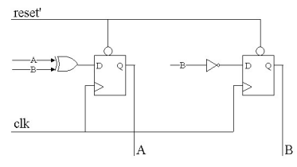

***

# Comparator Synthesis
- compares two input(A and B) and generate output signal
	- $A>B$ (Greater Than(GT))
	- $A<B$ (Less Than(LT))
	- $A=B$ (GT=0, LT=0)

**Circuit:**

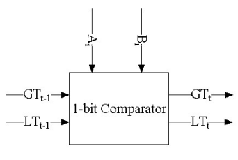


| $GT_{t-1}$ | $LT_{t-1}$ | $A_{i}$ | $B_{i}$ | $GT_{t}$ | $LT_{t}$ |
| ---------- | ---------- | ------- | ------- | -------- | -------- |
| 0          | 0          | 0       | 0       | 0        | 0        |
| 0          | 0          | 0       | 1       | 0        | 1        |
| 0          | 0          | 1       | 0       | 1        | 0        |
| 0          | 0          | 1       | 1       | 0        | 0        |
| 0          | 1          | x       | x       | 0        | 1        |
| 1          | 0          | x       | x       | 1        | 0        |
| 1          | 1          | x       | x       | 0        | 0         |

*Then*

$GT_{t}=\overline{LT_{t-1}}(\overline{GT_{t-1}} A_{i}\overline{B_{i}}+GT_{t-1})$

$LT_{t}=\overline{GT_{t-1}}(\overline{LT_{t-1}}\ \overline{A_{i}}B_{i}+LT_{t-1})$

##### Example
Three bit Comparator

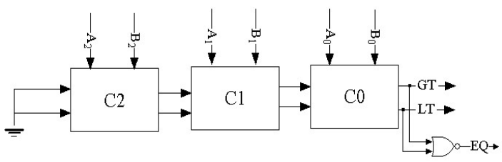

***

# Adder Synthesis

**Circuit:**

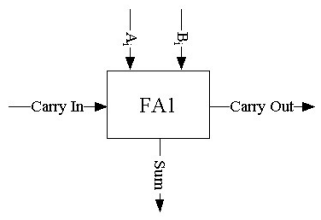

**Truth Table:**

| $C_{in}$ | $A_{i}$ | $B_{i}$ | Sum | $C_{out}$ |
| -------- | ------- | ------- | --- | --------- |
| 0        | 0       | 0       | 0   | 0         |
| 0        | 0       | 1       | 1   | 0         |
| 0        | 1       | 0       | 1   | 0         |
| 0        | 1       | 1       | 0   | 1         |
| 1        | 0       | 0       | 1   | 0         |
| 1        | 0       | 1       | 0   | 1         |
| 1        | 1       | 0       | 0   | 1         |
| 1        | 1       | 1       | 1   | 1          |

*then*

$Sum=C_{in} \oplus A_{i}\oplus B_{i}$
$C_{out}= B_{i}(C_{in} \oplus A_{i}) + C_{in}A_{i}$


##### Example
Three bit adder

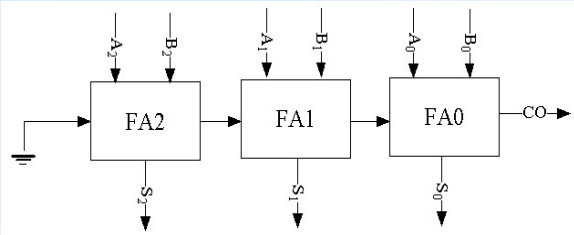

