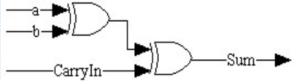
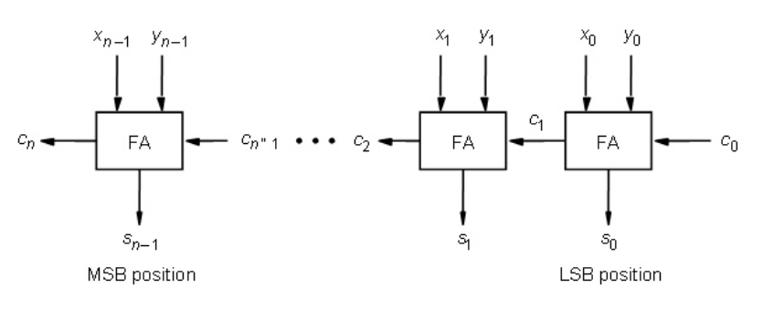
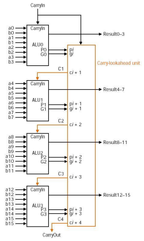

# MSB and LSB

***
# Signed Number
- MSB is used for sign
- `0` - positive
- `1` - negative
- Positive numbers have an infinite number of 0s on the left
- Negative numbers have an infinite number of 1s on the left

### 2's Complement
- representing negative numbers in binary
- perform addition and subtraction using the same hardware logic
- *Steps:*
	1. change the number to binary form
	2. invert all bits from 1 to 0 and 0 to 1
	3. add 1 to the number

***

# Addition
- overflow when adding two positive number and the sum is negative

***

# Subtraction
- for the negative value, use 2's complement
- overflow when adding two negative number and the sum is positive

***

# Logical Operation
## Shift Right
- e.g. $(1011)_{2}\to (0101)_{2}\to (0010)_{2}\to(0001)_{2}\to(0000)_{2}$

## Shift Left
- e.g. $(1011)_{2}\to(0110)_{2}\to(1100)_{2}\to(1000)_{2}\to(0000)_{2}$

## Bit-By-Bit And operation
e.g.

$(1101)_{2}$ *AND*

$\underline{(0001)_{2}}$

$(0001)_{2}$ *result*

## Bit-By-Bit Or operation
e.g.

$(1101)_{2}$ *or*

$\underline{(0001)_{2}}$

$(1101)_{2}$ *result*

***

# Adder
## Full Adder

## Half Adder

## Ripple Carry Adder

## Carry Lookahead Adders
- Ripple Carry Adders are too slow
- each bit addition must wait for the carry from the previous bit
- CLAs calculate carry signals in advance based on **propagate** and **generate** signals

### Generate $g_{i}$
- $g_{i}=a_{i}b_{i}$

### Propagate $p_{i}$
- $p_{i}=a_{i}+b_{i}$

### Carry $c_{i}$
- $c_{1}=g_{0}+p_{0}c_{in}$
- $c_{i+1}=g_{i}+p_{i}c_{i}$

##### Example
4-bit CLAs (16-bit adder)

*where*
- $c_{1}=g_{0}+p_{0}c_{in}$
- $c_{2}=g_{1}+p_{1}c_{1}=g_{1}+p_{1}(g_{0}+p_{0}c_{in})$
...

***
# Multiplication
- accomplished by shifting and addition