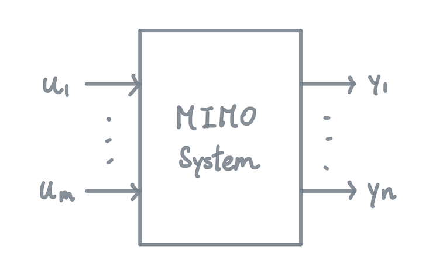

### Table Content
1. Systems
	1. MIMO System
	2. Homogenous System
	3. 

***

# Systems
### MIMO System
- Multi-Input Multi-Output System

with; 

$m$ scalar input ($u_{1},u_{2},\cdots, u_{m}$)

$n$ scalar outputs ($y_{1},y_{2},\cdots,y_{n}$)

### Homogenous System
- if all equations of a system do **not** depends on the inputs($u$) and their derivatives

##### Example (Homogeneous System)
$2y_{1}+\sin(30^◦)\frac{d^2y_{2}}{dt^2}-6y_{3}=t$
$-y_{2}+e^5y_{3}=5$

  
Homogeneous System

 <ul>
does not depends on any inputs
</ul>

##### Example (Non-Homogeneous System)
$2y_{1}+\sin(30^◦)\frac{d^2y_{2}}{dt^2}-6y_{3}+1=u_{1}+3 \frac{du_{2}}{dt}$
$-y_{2}+e^5y_{3}= \frac{dy_{2}}{dt}-ln(5)u_{3}$

  
Non-Homogeneous System

 <ul>
depends on inputs u
</ul>

### Linear System
iff
- all the input-output equations are linear
- 